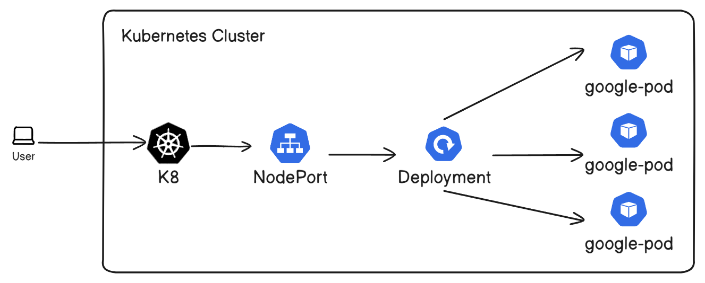

# W1-2 Lab (Setting up a deployment and service)

In this lab, we will run a deployment with 3 pods and a service.

Here is a diagram:



Use the following command to apply the deployment and service in W1-2 directory:

```
kubectl apply -f Kubernetes/
```

### Notes regarding the keys in YAML files:

* API Version: The version of the API we want to use for our object.
* Kind: The REST Resource the object represents (Pods, Deployments, etc.)
* Spec: Specification of the desired behavior for the given object.
* Replicas: Number of pods.
* Template: What describes the pods that are going to be created.
* -- Deployment using Selector: The label selector for pods. This must match the pod template's labels.
* Type: What service to use that will be exposed to the user.
* -- Service using Selector: Route service traffic to pods with label keys and values matching.
