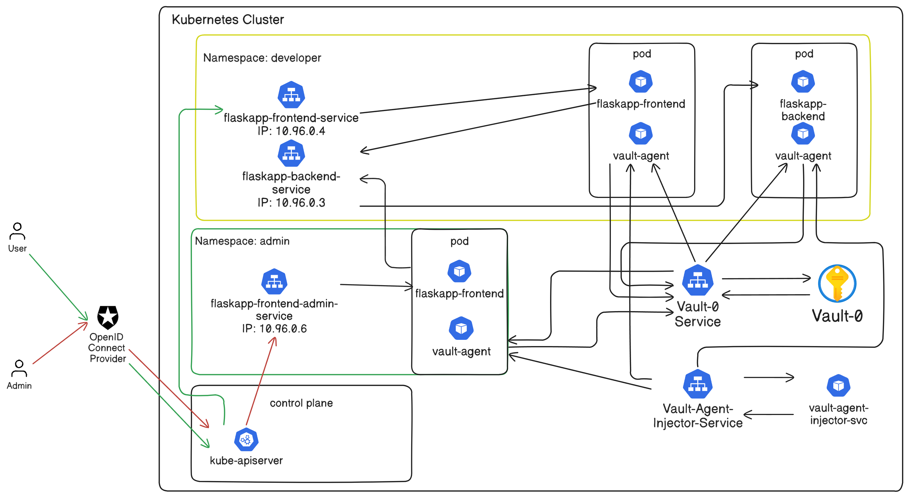

# W15-16: OpenID Connect & Hashicorp Vaults

## Prerequisites:

* Minikube must be downloaded in order to use OpenID.
* Creation of the OpenID Provider.
* Kubelogin has to be installed.
* > choco install kubelogin
* Helm Chart: hashicorp/vault, Version: 0.30.0

We will use the previous W9-10Lab and modify it to update it for this lab.

Here is a picture of the lab:



## Steps:

### 1.) Build and push dockerfiles for use

```
docker build . -f Dockerfile.frontend -t <docker-username>/flaskapp-frontend-w15-16:latest
docker build . -f Dockerfile.backend -t <docker-username>/flaskapp-backend-w15-16:latest
docker push <docker-username>/flaskapp-frontend-w15-16:latest
docker push <docker-username>/flaskapp-backend-w15-16:latest
```

### 2.) Start up minikube with Calico

```
minikube start --cni=calico --driver=docker \
--extra-config=apiserver.authorization-mode=RBAC,Node \
--extra-config=apiserver.oidc-issuer-url=https://accounts.google.com \
--extra-config=apiserver.oidc-client-id=YOUR_GOOGLE_CLIENT_ID \
--extra-config=apiserver.oidc-username-claim=email
```

### 3.) Apply Authorization to the users

```
kubectl apply -f ./Kubernetes/NamespaceAndServiceAccounts.yaml
```

### 4.) Apply kubectl configuration

```
kubectl config set-credentials oidc \
--exec-api-version=client.authentication.k8s.io/v1beta1 \
--exec-command=kubectl \
--exec-arg=oidc-login \
--exec-arg=get-token \
--exec-arg=--oidc-issuer-url=https://accounts.google.com \
--exec-arg=--oidc-client-id=<YOUR_GOOGLE_CLIENT_ID> \
--exec-arg=--oidc-client-secret=<YOUR_GOOGLE_CLIENT_SECRET> \
--exec-arg=--oidc-extra-scope=email
```

```
kubectl config set-context minikube-oidc --cluster=minikube --user=oidc
kubectl config use-context minikube-oidc
```

### 5.) Setup Hashicorp Vault

```
kubectl exec -it `<vault-pod-name>` -- /bin/sh
vault operator init -key-shares=1 -key-threshold=1
```

> Note: Grab the root token and unseal key from the output.

Perform the following commands from inside the pod:

```
vault operator unseal <unseal-key>
```

```
vault login <root-token>
```

### 6.) Enable and create secrets within Hashicorp Vault

```
vault secrets enable -path=secret kv-v2
vault kv put secret/flaskapp-backend-w15-16 POSTGRES_USER=<value> POSTGRES_DB=<value> POSTGRES_HOST=flaskapp-backend-service.developer.svc.cluster.local POSTGRES_PASSWORD=<value>
```

> Verify if key is there: `vault kv get secret/flaskapp-backend-w15-16`

### 7.) Enable Kubernetes Auth Method

```
vault auth enable kubernetes
vault write auth/kubernetes/config kubernetes_host="https://$KUBERNETES_PORT_443_TCP_ADDR:443"
```

### 8.) Define Vault Policy for Kubernetes to Access

```
vault policy write webapp -  <<EOF
path "secret/data/flaskapp-backend-w15-16" {
  capabilities = ["read"]
}
EOF
```

Bind the policy to the Kubernetes service account

```
vault write auth/kubernetes/role/webapp \
bound_service_account_names=dev-account,admin-account \
bound_service_account_namespaces=developer,admin \
policies=webapp \
ttl=24h
```

### 9.) Apply the rest of YAML files

```
kubectl apply -f ./Kubernetes/
```

# Testing In Minikube context

## Test to see if flaskapp-frontend-admin pod is receiving a connection time out.

```
kubectl exec -it flaskapp-frontend -n developer -- curl --max-time 5 http://flaskapp-frontend-admin-service.admin.svc.cluster.local:80
```

## Add port forwarding to minikube for NodePort and separate ClusterIP port.

```
minikube service flaskapp-frontend-service --url -n developer
```

```
kubectl port-forward svc/flaskapp-frontend-admin-service -n admin 50000:80
```

# Testing Kubelogin

## Clean Kubelogin token for login use

```
kubelogin clean
```
