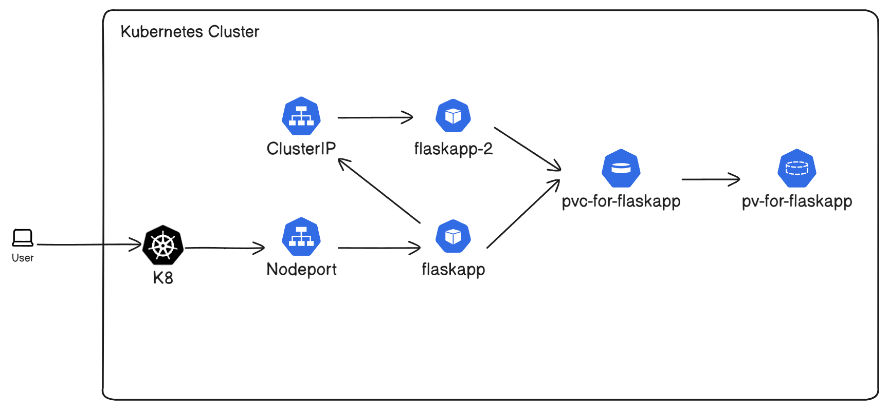

For this lab we will demonstrate ClusterIP and NodePort and how these 2 services work.

We will also use the concepts of PV and PVCs to create volumes for our pods.

Here is a diagram:



# **PERFORM THESE COMMANDS BEFORE YOU RUN THE YAML FILES:**

Set up docker install

```
docker build . -t <dockerusername>/flaskapp:latest
```

Set up a private hub repository:

```
docker push <dockerusername>/flaskapp:latest
```

Create a Secret so Kubernetes can access the private hub repository.

``kubectl create secret docker-registry <secret-name> --docker-server=docker.io --docker-username=<your-name> --docker-password=<your-pword> --docker-email=<your-email>``

Create a data directory in W3-4Notes Directory for mounting of PV:

```
mkdir data
```

Update the hostPath in the PV.YAML to match the file in your folder:

```
/run/desktop/mnt/host/<WSL-file-path-to-data-directory>
```

## Connecting to flaskapp on NodePort:

```
curl http://localhost:30000
```

## Connecting to flaskapp2 on ClusterIP from flaskapp:

```
kubectl exec -it flaskapp-pod -- curl cluster-ip-service-to-flaskapp2:81
```
