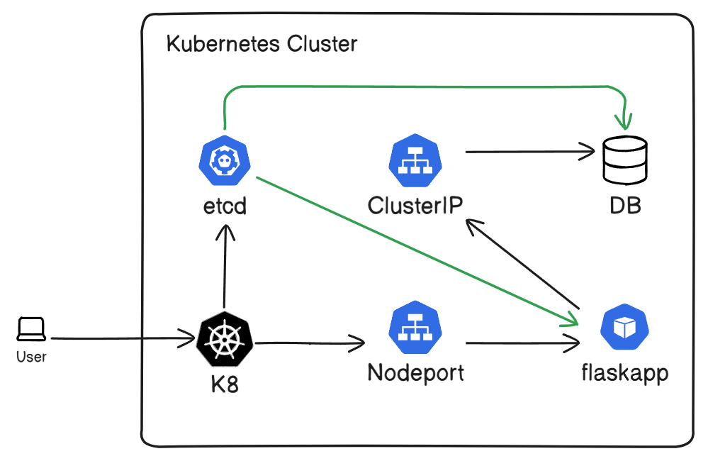

# W5-6 Lab (ConfigMaps & Secrets):

For this lab, we will demonstrate how we use ConfigMaps and Secrets in our application. We will also use W3-4 lab as a base for what we're doing.

Here is the image:



## How to set up the lab:

Make sure you are in the W5-6Notes directory before you continue.

Side Note: Docker Hub has marked your repos as public by default.

To create this setup, we first need to create our images from our Dockerfiles:

```
docker build . -t <docker_username>/flaskapp-frontend-w5-6:latest -f Dockerfile.frontend
docker build . -t <docker_username>/flaskapp-backend-w5-6:latest -f Dockerfile.backend
```

Now push both images:

```
docker push <docker_username>/flaskapp-frontend-w5-6:latest
docker push <docker_username>/flaskapp-backend-w5-6:latest
```

Run all Kubernetes object YAML files:

```
kubectl apply -f Kubernetes/
```

### Notes:

You can look up the tables in the database using the following command:

```
kubectl exec -it flaskapp-backend -- psql -U randy-brown-pod -d randy-brown-pod-db
```
