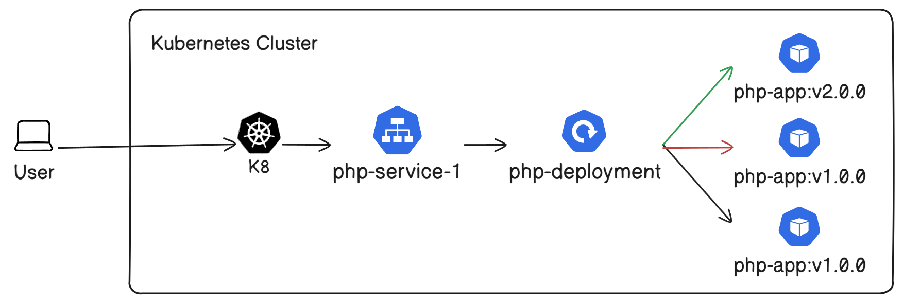
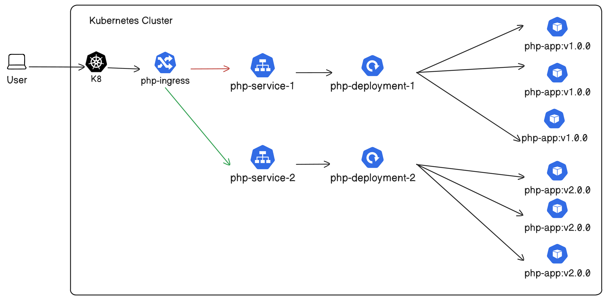
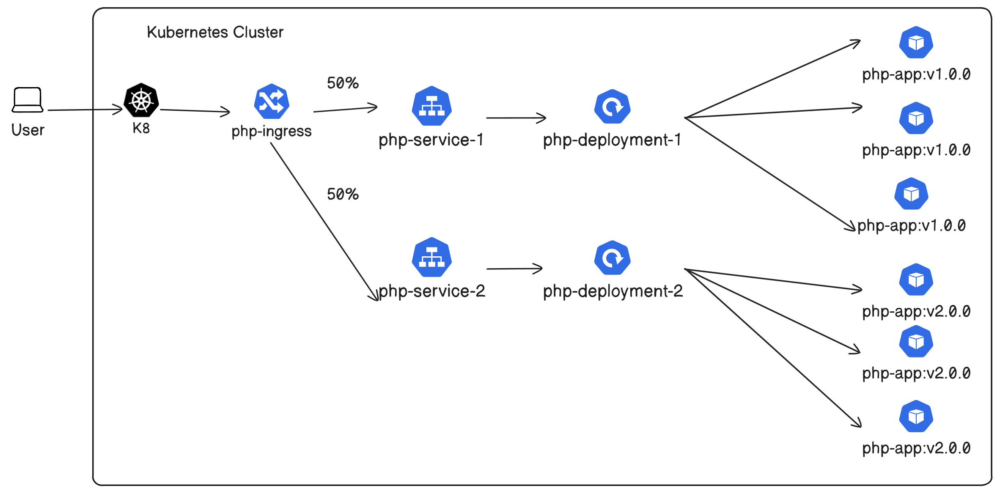
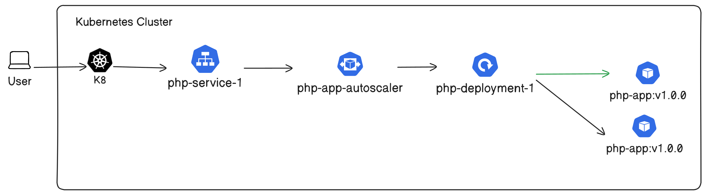

# W7-8 Lab (Deployments, Scaling, and Ingress):

## Prerequisites

* Needed helm charts to run the objects:
  * Ingress:

    * Name: nginx-ingress-controller
    * Version: 11.6.10
    * Repository: bitnami
  * HPA:

    * Name: metrics-server
    * Version: 3.12.2
    * Repository: metrics-server

    > Note: Apply this line to args with the metrics-server yaml file.
    >

    ```yaml
    args:
    - --kubelet-insecure-tls
    ```
  * VPA:

    * Name: vertical-pod-autoscaler
    * Version: 10.0.0
    * Repository: cowboysysop
* Building two Versioned Applications.
  * ```
    docker build -t <docker-username>/php-app:v1.0.0 .
    docker build -t <docker-username>/php-app:v2.0.0 .
    ```
* Pushing two Versioned Applications.
  * ```
    docker push <docker-username>/php-app:v1.0.0
    docker push <docker-username>/php-app:v2.0.0
    ```

### How to perform a rolling update:

Picture of rolling update:



1. Apply the yaml files in RollingUpdate directory:

```bash
kubectl apply -f ./Kubernetes/RollingUpdate/
```

2. To access the website, put into the URL:

```
http://localhost:30000
```

3. Go to deployment.yaml in the RollingUpdate directory and update your image and ConfigMap to v2.0.0

```yaml
apiVersion: apps/v1
kind: Deployment
metadata:
  name: php-deployment
spec:
  replicas: 3
  selector:
    matchLabels:
      app: php-app
  strategy:
    type: RollingUpdate
  template:
    metadata:
      labels:
        app: php-app
    spec:
      containers:
        - image: <docker-username>/php-app:<version>
          name: php-app
          ports:
          - containerPort: 80
          envFrom:
            - configMapRef: 
                name: pod-<version>
```

4. Now apply the Deployment.yaml file in the RollingUpdate directory:

```bash
kubectl apply -f ./Kubernetes/RollingUpdate/Deployment.yaml
```

5. Access the website again and you should see a difference

### How to perform a Blue-Green deployment:

Picture of Blue-Green deployment:



1. Apply yaml files in Blue-Green directory

```bash
kubectl apply -f ./Kubernetes/Blue-Green/
```

2. To access the website, put the link into the URL:

```
http://localhost:80
```

3. Go to the Ingress.yaml file and replace service name with php-service-2.

```yaml
apiVersion: networking.k8s.io/v1
kind: Ingress
metadata:
  name: php-ingress
spec:
  ingressClassName: nginx
  rules:
    - http:
        paths:
          - pathType: Exact
            path: /
            backend:
              service:
                name: php-service-<number>
                port:
                  number: 80
```

4. Now apply the Ingress.yaml file.

```bash
kubectl apply -f ./Kubernetes/Blue-Green/Ingress.yaml
```

5. Now access the website again and you should see a difference.

### How to perform a Canary deployment:

Picture of Canary deployment:



1. Apply yaml files in canary directory

```bash
kubectl apply -f ./Kubernetes/Canary/
```

2. Now access the URL multiple times

```
http://localhost:80
```

### How to deploy a HPA

Picture of HPA deployment:



1. Apply yaml files in HPA directory

```
kubectl apply -f ./Kubernetes/HPA/
```

2. Wait a few minutes until autoscaler is ready (metrics should not show unknown).
3. Apply a yaml job to increase autoscaler CPU:

```
kubectl apply -f ./Kubernetes/Load/
```

### How to deploy a VPA

1. Apply yaml files in VPA directory

```
kubectl apply -f ./Kubernetes/VPA/
```

2. Wait a few minutes until autoscaler is ready.
3. Check the VPA

```
kubectl describe vpa php-app-autoscaler
```

3. Apply a yaml job to increase autoscaler CPU:

```
kubectl apply -f ./Kubernetes/Load/
```

4. Check the VPA again
