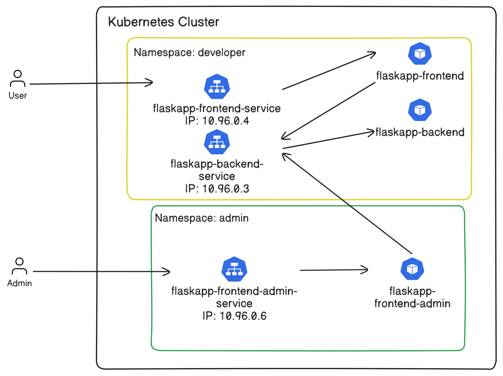

# W9-10 Lab: (RBAC, Network Policies, Security Contexts)

## Prerequisites:

* Minikube must be downloaded in order to perform network policies.

We will use the previous W5-6Lab and modify it to update it for this lab.

Here is a picture of the lab (does not include ConfigMaps and Secrets for clarity):



## Steps:

### 1.) Build and push dockerfiles for use

```
docker build . -f Dockerfile.frontend -t <docker-username>/flaskapp-frontend-w9-10:latest
docker build . -f Dockerfile.backend -t <docker-username>/flaskapp-backend-w9-10:latest
docker push <docker-username>/flaskapp-frontend-w9-10:latest
docker push <docker-username>/flaskapp-backend-w9-10:latest
```

### 2.) Start up minikube with Calico

```
minikube start --cni=calico --driver=docker
```

### 3.) Apply yaml files

```
kubectl apply -f ./Kubernetes/Namespaces.yaml -f ./Kubernetes/
```

### Optional: Add RBAC Permissions for developer and admin

```
kubectl create token <service-account-name> -n <service-account-namespace>
kubectl config set-credentials <service-account-name> --token=<service-account-token>
kubectl config set-context <name> --cluster=minikube --user=<service-account-name> --namespace=<service-account-namespace>
kubectl config use-context <name>
```

### 4.) Add port forwarding to minikube for NodePort and separate ClusterIP port.

```
minikube service flaskapp-frontend-service --url -n developer
```

```
kubectl port-forward svc/flaskapp-frontend-admin-service -n admin 50000:80
```

## Test to see if flaskapp-frontend-admin pod is receiving a connection time out.

```
kubectl exec -it flaskapp-frontend -n developer -- curl --max-time 5 http://flaskapp-frontend-admin-service.admin.svc.cluster.local:80
```
